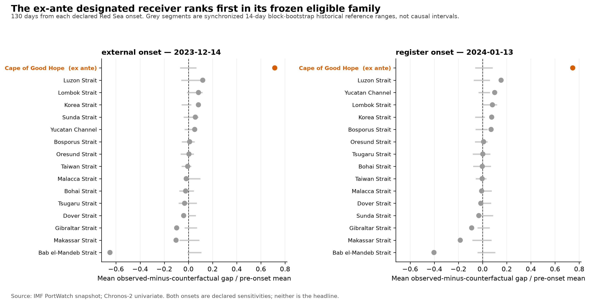
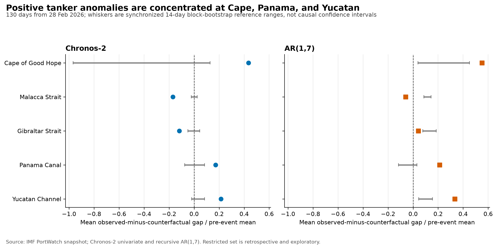
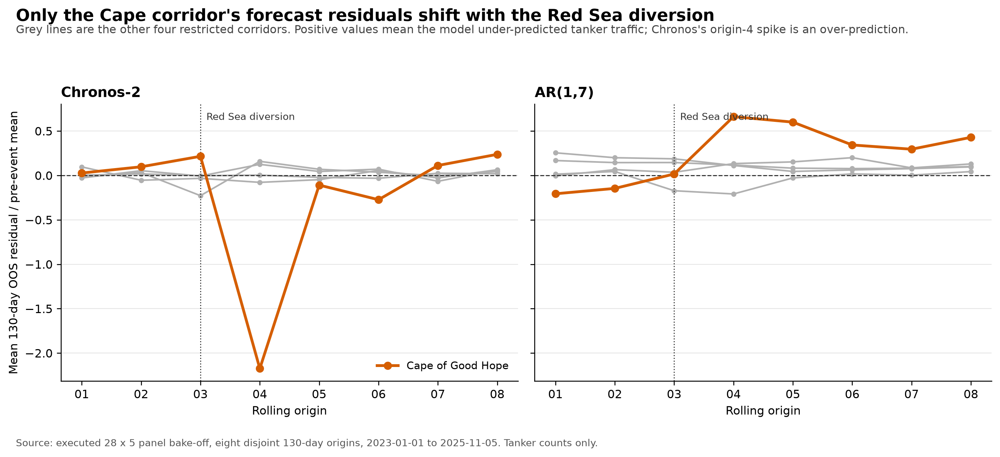
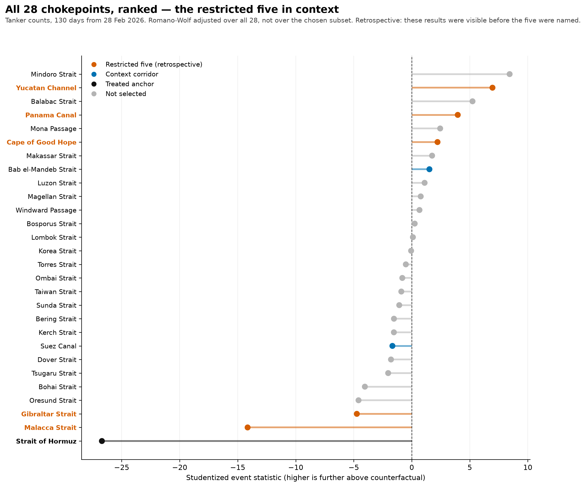

# Secondary analysis: selective maritime-network adaptation after the Hormuz disruption

## Empirical status and claim boundary

This chapter reports an executed exploratory analysis. All forecasts, bootstrap
draws and robustness checks described below were generated from the pinned IMF
PortWatch snapshot. The analysis supports a claim about **positive abnormal
tanker activity compatible with network adaptation or alternative-source
substitution**, and that claim rests on two corridors — Panama Canal and Yucatan
Channel — not on the family-level screen and not on the Cape of Good Hope, for
reasons sections 6.5 and 6.6 set out. It does not identify physical rerouting,
displaced Hormuz volume, an LNG-specific response or a causal treatment effect.

The five-corridor analysis set is a retrospective restriction, not a
preregistration. An earlier all-corridor AR analysis had already exposed
post-event results, including positive deviations at the Cape of Good Hope,
Panama Canal and Yucatan Channel. The resampling p-values in section 6 are
therefore descriptive measures of separation from historical forecast errors;
they must not be presented as confirmatory discoveries selected independently of
the data. Section 5 is different in kind: it applies the same machinery to the
2023 Red Sea diversion, whose receiver was designated on route topology before
any post-onset outcome was inspected, so the method is demonstrated once on an
event where selection is not in question.

## 1. Research question and contribution

The primary throughput analysis asks how far observed tanker traffic at the
Strait of Hormuz fell below a normal-conditions counterfactual. That result is
important for measurement, but its direction is mechanically unsurprising.
This secondary analysis asks a less direct question:

> During the 130 days following 28 February 2026, did selected non-Hormuz
> maritime corridors exhibit positive tanker-count deviations relative to
> leakage-safe counterfactual forecasts, and were those deviations specific to
> tankers rather than common to unrelated vessel classes?

The broad empirical territory is not empty. Yang et al. (2026) use Sentinel-1
synthetic-aperture radar to examine shipping reorganization during the same
crisis and report an approximately 30% increase in traffic around the Cape of
Good Hope. Their comparison covers 28 February–27 March and has the major
advantage of not relying on cooperative AIS transmission. The present analysis
does not claim to discover rerouting first. Its narrower addition is a 130-day,
multi-corridor counterfactual design that compares an admitted time-series
foundation model with a transparent autoregression, calibrates the network
statistics on genuinely out-of-sample historical forecast errors, and subjects
the apparent tanker signal to vessel-class negative controls.

That last question — whether a better forecaster matters more for weak secondary
signals than for an overwhelming closure — is answered here in the negative, and
the answer is part of the contribution. Section 6.3 reports that the two models
agree on the secondary pattern and pass the same falsification test once the
control family is hardened; the apparent difference between them was an artifact
of how the control family was weighted. The chapter therefore does not argue that
the foundation model was necessary to see the network pattern. What it
demonstrates instead is how much of an apparently clean multi-corridor result
survives being stress-tested: a family-level screen, a multiplicity correction and
a negative-control family each look convincing until the weighting, the family
composition and the stationarity of the reference distribution are examined
directly. The chapter also separates the two questions a retrospective screen
conflates, by validating the machinery on an event with an ex-ante designated
receiver (section 5) before applying it to a corridor set that was chosen after
the fact (section 6).

## 2. Data and measurement

The data are the pinned IMF PortWatch `Daily_Chokepoints_Data` snapshot
(SHA-256 `66f3a54a...93f579d`). It contains a complete daily grid of 28
chokepoints from 1 January 2019 through 12 July 2026: 77,000 unique
chokepoint-day observations, with no duplicate keys or missing values in the
three outcomes used here. PortWatch derives maritime indicators from AIS data
provided through the United Nations Global Platform. The IMF documentation
notes both the value of daily coverage and limitations arising from reception,
coverage and methodological revisions.

The primary outcome is `n_tanker`, the daily number of tanker transits. It is
stationary enough for the forecasting geometry used here according to the
separate panel diagnostics. What that category contains is a vendor definition
rather than a modelling choice, so section 2.1 takes it from the IMF's own
documentation instead of inferring it from the data.

### 2.1 What the tanker series contains, and what the documentation does not say

PortWatch publishes the chokepoint file under five ship categories — container,
dry bulk, general cargo, ro-ro and tanker — and states that all indicators are
available by those five. `n_cargo` is documented as the sum of the first four
and `n_total` as the sum of all five, which the executed panel geometry confirms
holds exactly on every one of the 77,000 rows. A transit call is documented as a
ship crossing the chokepoint boundary, with transits spanning several days
counted once and a 48-hour threshold before the same ship is counted again. The
outcome used here is defined in a single line: `n_tanker` is the number of
tankers transiting the chokepoint on that date.

**The documentation stops there.** It does not enumerate tanker sub-types, and it
does not state whether gas carriers — LNG or LPG — are counted inside `n_tanker`
or fall outside the classification altogether. No gas category exists among the
five, so exactly one of those two must be true, and the IMF documentation does
not say which. The file cannot settle it either: it carries per-category transit
counts and estimated payload tonnage, and no vessel identity at all.

The consequence is not a caveat about precision, it is a boundary on the claim.
**No LNG-specific reading of this chapter is available in either direction.**
If gas carriers are inside `n_tanker` they are not separable from crude, product
and chemical tankers, and an anomaly of the size reported in section 6 could be
composed entirely of oil movements. If they are outside it, LNG traffic is
invisible to this outcome and cannot be spoken about at all. The chapter
therefore makes statements about tanker transits and about nothing narrower.
This is the measurement reason for the claim boundary stated at the top; it is
not a residual worry that better inference would remove.

**The classification is also versioned, and two of its revisions touch this
design.** PortWatch's Data & Methodology changelog records that the vessel
classification was expanded in 2024 from two categories, cargo and tanker, to
the five used here; that in 2025 the classification of general cargo and ro-ro
vessels was refined; and that in March 2026 the chokepoint boundary for
`chokepoint6`, the Strait of Hormuz, was itself refined. The 2025 refinement
falls inside the 2023–2025 calibration window and touches half of the
negative-control family, whose Ro-Ro series section 6.3 already shows to be the
most fragile part of that family. The March 2026 boundary change redefines the
treated anchor corridor.

Neither is a break inside the analysed series. The changelog records each of
these as the series having *been revised*, that is, applied backwards across the
whole history rather than switched on from a date, and the vintage comparison
below confirms that behaviour empirically. The pinned snapshot was retrieved on
15 July 2026, so it already embodies the post-March-2026 Hormuz boundary and the
post-2025 ro-ro rules on every date from 2019 onward. The exposure is therefore
across vintages, not within one: a later capture revises 97.45% of overlapping
Hormuz days and lowers the configured pre-cutoff training mean by 17.68%, which
is why `docs/PORTWATCH_VINTAGE_REGISTER.md` keeps this vintage as the reporting
basis and carries the newer one as a separate sensitivity layer rather than a
refresh. The August 2026 revision post-dates the pinned capture and is not in it;
the changelog dates its entries only to the month, so the July 2026 entry cannot
be placed relative to a 15 July capture and is treated as possibly present.

### 2.2 Why the event window ends on 7 July 2026

The event window begins at the operational cutoff of 28 February 2026 and ends
on 7 July 2026, giving exactly 130 daily observations. Two facts about that end
date are worth stating plainly, because they are easy to mistake for one
another.

**The end date is a data-availability boundary.** The pinned snapshot's last
date is 12 July 2026, and the study-window rule declared in
`docs/WINDOW_EXTENSION_V2_RUNBOOK.md` sets the analysable end to the maximum
complete date minus a five-day buffer, because PortWatch's trailing days can be
incomplete. That rule, applied to this snapshot, returns 7 July 2026. Nothing
substantive about the disruption selects it.

**The 130-day horizon is then a consequence of that boundary, not an independent
choice that happened to fit.** 28 February to 7 July inclusive is 130 days, and
130 is what `config/model_admission_protocol.yaml` fixes as
`expected_scored_days` and what the panel bake-off uses as its long horizon at
all eight rolling origins. The matched design in section 4 exists so that the
event window and its historical reference have identical length; the length
itself came from the data boundary.

A longer window was available and was examined. A fresh PortWatch capture
extends to 1 August 2026, but adopting it would also swap the data vintage, and
the vintage register records what that costs: 97.45% of overlapping Hormuz days
revised and a 17.68% lower pre-cutoff training mean. Measured on the primary
throughput outcome, extending the window by 25 days moves the daily shortfall by
+0.6% while changing vintage at identical dates moves it by −17.1%. The window
end is therefore not where the evidence stops being informative; it is where
this vintage stops, and the extension is reported as a sensitivity rather than
folded into the headline.

One coincidence should be disclosed rather than left for a reader to find.
7 July 2026 is also a dated entry in `docs/EVENT_CHRONOLOGY.md` — attacks on
three commercial ships within 24 hours, read at the time as the breakdown of the
June memorandum. The window does not end on that date for that reason, and no
result here is conditioned on it, but the analysis does stop on the day of a
documented escalation and says nothing about what followed it.

Five non-Hormuz corridors form the restricted tanker family:

| Corridor | Ex-ante economic role used for interpretation |
|---|---|
| Cape of Good Hope | Atlantic–Indian Ocean long-haul and supply-reorganization screen |
| Malacca Strait | Asia-bound energy gateway and destination-side screen |
| Gibraltar Strait | Atlantic–Mediterranean and European alternative-supply screen |
| Panama Canal | Americas-to-Pacific fleet-deployment and alternative-supply screen |
| Yucatan Channel | US Gulf/Caribbean export-gateway screen |

Strait of Hormuz, Suez Canal and Bab el-Mandeb are retained as descriptive
context series. They are not donors: Hormuz is the disruption anchor, while Suez
and Bab el-Mandeb may be affected by concurrent regional shocks. Ro-Ro
(`n_roro`) and dry-bulk (`n_dry_bulk`) activity at the same five candidate
corridors constitute a ten-series negative-control family. The frozen config
declares that a positive control result would weaken a tanker-specific
interpretation and that a null one cannot prove the tanker mechanism. The second
half of that is right; the first half is too strong, for a reason that only
became clear once the Red Sea positive control had been run, and section 6.3
restates what the family actually tests.

## 3. Counterfactual models

The primary forecaster is the frozen univariate Chronos-2 model, revision
`29ec3766...50e8498c`, used zero-shot with a maximum 2,048-day context and no
cross-series learning. Chronos-2 was chosen before this extension because the
global 28-by-5 panel bake-off found that it reduced 130-day MASE by 14.5% relative
to AR(1,7), with positive gains across every vessel class. The 130-day horizon is
the one this chapter uses, and it is the weaker of the two benchmark horizons:
its clustered 95% reduction interval is [1.4%, 23.7%], against [11.4%, 25.0%] at
30 days. The accuracy advantage that motivates the model choice here is
therefore positive but imprecisely estimated. The recursive AR(1,7)
model, using lags one and seven, remains the transparent robustness benchmark.
Neither model observes contemporaneous post-cutoff donor outcomes.

For model (m), corridor (i) and day (t), define the forecast residual as

\[
e^{(m)}_{it}=y_{it}-\widehat y^{(m)}_{it}.
\]

The corridor statistic is the mean 130-day residual scaled by that corridor's
own pre-event mean:

\[
D^{(m)}_i=
\frac{H^{-1}\sum_{t=1}^{H}e^{(m)}_{it}}
{\bar y_{i,\mathrm{pre}}}, \qquad H=130.
\]

Positive values denote above-counterfactual activity. Scaling permits
comparison across corridors with different traffic levels. It does not convert
the statistics into reallocatable shares: the same voyage may cross multiple
chokepoints, so corridor gaps must never be summed as displaced traffic.

### 3.1 The event analysis is forecast-only, and that is a design property

Every counterfactual reported in this chapter and in section 5 is produced by a
model that sees only the treated series' own past. Chronos-2 is used zero-shot
with no cross-series learning; AR(1,7) is recursive on its own lags. No
donor-assisted estimator is used anywhere in the event window. Synthetic
control, interactive fixed effects and nuclear-norm matrix completion appear in
this project only inside the pre-event panel bake-off, where all scoring ends
before the 28 February 2026 cutoff, and they are reported in a separate league
from the forecast-only methods precisely because they observe contemporaneous
spatial donors. Neither event experiment imports them.

That is worth claiming rather than leaving implicit, because it removes an
entire class of objection by construction rather than by argument.

**Donor contamination cannot affect these results.** A donor-based
counterfactual for a chokepoint disruption has an uncomfortable structure: the
untreated units supplying the counterfactual are other corridors, and the
hypothesis under test is that traffic moved between corridors. If the hypothesis
is true the donors are treated, the fitted counterfactual absorbs part of the
response, and the estimate is biased toward the observed path. The more
successful the reallocation, the worse the bias. This chapter's central claim —
that traffic at some corridors ran above counterfactual — is exactly the
condition under which a donor design fails, and it is exactly the condition this
design is insensitive to. The same applies to interference between the treated
anchor and the candidate receivers: Hormuz, Suez and Bab el-Mandeb are carried
as descriptive context and are not donors, so no post-cutoff observation at any
corridor enters any other corridor's counterfactual.

The property also disciplines the negative controls. A Ro-Ro or dry-bulk
counterfactual at the Panama Canal is built from that series' own history and
from nothing about tankers, so a null control is not an artifact of the tanker
result having been partialled out of it.

**What it costs is stated with equal directness.** A forecast-only counterfactual
buys this immunity by refusing all contemporaneous information, so anything that
would have moved a corridor in the event window for reasons unrelated to the
disruption — weather, demand, fleet scheduling, a concurrent regional shock — is
unmodelled rather than differenced away. Limitation 5 is the price of this
section's guarantee, not an independent problem. The historical reference
distribution in section 4 is what carries the burden a donor pool would
otherwise carry, and section 6.5 shows that reference failing at one corridor.

## 4. Dependence-aware historical reference

Normal-theory standard errors based on
\(\widehat\sigma\sqrt{H}\) would incorrectly treat daily residuals as
independent. Instead, the analysis reuses the executed bake-off's genuinely
out-of-sample 130-day residuals. Eight common, disjoint rolling origins cover
1,040 consecutive pre-event dates from 1 January 2023 through 5 November 2025.
No calibration date reaches the event cutoff.

The primary reference distribution uses 10,000 synchronized circular
moving-block draws with 14-day blocks. Within each draw, identical time indices
are selected for every corridor and vessel class. This preserves short-run
serial dependence as well as contemporaneous cross-corridor dependence. Seven-
and 28-day blocks test sensitivity to the dependence horizon. These are
historical forecast-error reference distributions, not causal confidence
intervals.

Inference proceeds in two stages. First, an equally weighted global statistic
averages the five scaled tanker deviations. Second, corridor-level one-sided
tests use the Romano–Wolf step-down procedure within the five-corridor family.
The resampling distribution is studentized and centered on each model's
historical forecasting bias. The ten negative controls form a separate
Romano–Wolf family. Using separate families is justified by their distinct role:
the first screens the proposed mechanism, while the second attempts to falsify
its vessel-class specificity.

### 4.1 The full decision surface

Multiplicity in this project is controlled inside families, and there are
several families across two events and a model bake-off. A reader should not
have to add them up, so the whole surface is stated once, here.

| Stage | Hypotheses | Cells each | Resampling p-values |
|---|---:|---:|---:|
| Panel bake-off, admission decisions | 5 paired model comparisons | — | 0 |
| Panel bake-off, paired comparisons (2 panels x 2 horizons) | 16 rows | — | 0 |
| Section 5, eligible receiver family | 16 corridors | 12 | 192 |
| Section 5, ex-ante designated anchor | 1 corridor | 12 | 12 |
| Section 5, anchor vessel-class controls | 2 series | 12 | 24 |
| Section 5, family-level global screens | 3 families | 12 | 36 |
| Section 6, restricted tanker family | 5 corridors | 6 | 30 |
| Section 6, negative-control family | 10 series | 6 | 60 |
| Section 6, family-level global screens | 2 families | 6 | 12 |
| Section 6.3 and 6.6, weighting and leave-one-out re-runs | 2 families | varies | 132 |
| Section 6.7, all-corridor ranking | 28 corridors | 6 | 168 |
| Section 6.6 and 6.7, widened global screens | 4 variants | 6 | 24 |
| Context series, both events | 5 series | — | 0 |
| Hormuz shortfall specification sensitivity | 4 specifications | — | 0 |
| **Total** | **56 tested series-level hypotheses** | | **690** |

The hypothesis column does not sum to the total, and should not: the 28-corridor
ranking nests the restricted five, the designated anchor is also a member of the
16-corridor receiver family, and the family-level screens re-test series already
counted individually. Counting each distinct series-level hypothesis once across
both events gives 56 — 38 in the Hormuz event (28 tanker corridors and 10 control
series) and 18 in the Red Sea event — with five further context series carried
descriptively and never tested.

A cell is one (model, block length) pair in section 6 and one (onset, model,
block length) triple in section 5, so six and twelve respectively. The 690
p-values are not 690 independent questions: they are 56 series-level hypotheses,
each re-tested under declared model, block-length and onset sensitivities, plus
204 family-level screens that re-express the same families under four weighting
and eligibility variants. The panel bake-off contributes no p-values at all —
its admission rule is a set of point-estimate gates, and its clustered bootstrap
intervals are an uncertainty diagnostic the rule never referenced.

**What Romano–Wolf covers.** The step-down procedure controls the familywise
error rate within one named family, at one cell, on that cell's own synchronized
resamples. That is the whole of its guarantee.

**What it does not cover, stated explicitly.** It does not adjust across the two
models, across the three block lengths, across the two onsets in section 5,
across the tanker and control families, across the two events, or across the
weighting variants in section 6.3. It also cannot adjust for the selection that
produced the restricted five in the first place, which is the separate and more
serious problem section 6.7 discloses rather than corrects.

**The rule this chapter applies instead.** Because the cells are not corrected
jointly, no result is reported on the strength of the cell that favours it. A
corridor counts as a finding only if it clears the adjusted threshold in *every*
cell of its family. The counts that rule produces:

| Family | Cells | Cells with p < 0.05 | Clears in all cells | Also clears somewhere |
|---|---:|---:|---|---|
| Section 6 restricted tanker (5) | 6 | 17 of 30 | Panama, Yucatan | Cape |
| Section 6 negative controls (10) | 6 | 2 of 60 | none | Cape Ro-Ro |
| Section 6.7 all corridors (28) | 6 | 25 of 168 | Panama, Yucatan, Mindoro | Cape, Balabac, Kerch |
| Section 5 eligible receivers (16) | 12 | 42 of 192 | Cape of Good Hope | Bosporus, Korea, Luzon, Sunda, Yucatan |
| Section 5 anchor controls (2) | 12 | 21 of 24 | Cape dry bulk | Cape Ro-Ro |

The last column lists corridors that clear in some cells but not all, so the two
right-hand columns are disjoint. The gap between them is where multiplicity
actually bites.
Seventeen of thirty restricted-family cells are individually flagged, but only
two corridors are flagged in all six; forty-two of the 192 receiver-family cells
are flagged, but only the ex-ante designated receiver is flagged in all twelve.
Reporting the flagged cells alone would have produced three positive corridors in
section 6 and six in section 5.

This is a reporting discipline, not a formal correction: requiring all six cells
is neither a Bonferroni adjustment over cells nor a test with a known joint
level, and the cells are strongly dependent because they share the observed data.
It is stated as a rule so that it cannot be relaxed for a corridor a reader might
prefer.

## 5. Positive control: the method where the receiver was named in advance

The restricted corridor set analysed in section 6 is a retrospective screen. An
all-corridor post-event AR map already existed when the five corridors were
named, so no p-value reported there can be confirmatory, however carefully it is
adjusted. Romano–Wolf controls multiplicity conditional on the family tested; it
cannot recreate a selection that did not happen.

There is one event in this data where the selection *did* happen in advance. The
Red Sea diversion of December 2023 has a receiver that was designated on route
topology, and recorded in `config/hormuz_receiver_test.yaml`, before any
post-onset outcome was inspected: the Cape of Good Hope is the only long-haul
substitute for the Bab el-Mandeb/Suez route. The eligible family the Cape is
ranked within was frozen at the same time, on pre-onset volume alone. This
section runs the identical estimator, bootstrap and multiplicity machinery on
that event, so the method can be demonstrated where the selection objection does
not apply. Section 6 is then a retrospective screen of an already-validated
method rather than a method and a result introduced together.

### 5.1 Design

Everything is held identical to section 6 except the event. The counterfactual is
the same leakage-safe pair, Chronos-2 univariate and recursive AR(1,7), trained
strictly on pre-origin observations. The statistic is the same mean
observed-minus-counterfactual gap over 130 days, scaled by the series' own
pre-onset mean. The historical reference is the same synchronized circular
moving-block bootstrap, built here from eight contiguous, disjoint 130-day
out-of-sample origins ending the day before the onset, so it spans exactly 1,040
days and contains no post-onset information. Multiplicity is the same Romano–Wolf
step-down within explicitly named families.

Both onsets declared in the frozen B2 specification are reported and neither is
the headline, exactly as that specification requires: the external onset
(2023-12-14, carrier suspensions) and the register onset (2024-01-13,
data-derived). The register onset's own limitation carries into this design —
the last 30 days of its residual reference and of its scaling window already sit
inside the diversion.

### 5.2 The designated receiver

| Onset | Model | Event statistic | Cumulative gap | Rank in frozen family | Romano–Wolf p |
|---|---|---:|---:|---:|---:|
| external (2023-12-14) | Chronos-2 | 0.715 | +1,012 | **1 of 16** | 0.0001 |
| external (2023-12-14) | AR(1,7) | 0.592 | +839 | **1 of 16** | 0.0001 |
| register (2024-01-13) | Chronos-2 | 0.746 | +1,059 | **1 of 16** | 0.0001 |
| register (2024-01-13) | AR(1,7) | 0.759 | +1,077 | **1 of 16** | 0.0001 |

The anchor is the family maximum in all four cells, at every block length, and by
a wide margin: its studentized statistic under Chronos at the external onset is
20.9 against 4.7 for the runner-up. The ordering of the family is what a real
reallocation should look like from end to end — the designated receiver first at
+0.715, the designated emitter last at −0.650 — and the emitter was not used to
construct the receiver's statistic.



*Figure: 130-day event statistics for the frozen 16-corridor eligible family
under Chronos-2, at each declared onset. Grey segments are synchronized 14-day
block-bootstrap historical reference ranges.*

The context series behave as designed without being used in any test: the emitter
Bab el-Mandeb runs −0.317 to −0.650 and Suez −0.205 to −0.555 across the two
onsets and two models.

### 5.3 The negative controls fire here — and that is the point

Ro-Ro and dry-bulk traffic at the Cape moved too, strongly. Cape Ro-Ro reaches
+1.77 to +2.17 and Cape dry bulk +0.29 to +0.46, with Romano–Wolf adjusted values
of 0.0001.

That is the correct answer. The Red Sea diversion rerouted long-haul traffic of
every class around the Cape; a control family that stayed null on this event
would be broken. **This is a positive control for the control family itself.** It
establishes empirically that these controls do fire when a corridor moves as a
whole rather than by vessel class — which is exactly what makes their *silence*
in section 6.3 informative rather than vacuous. Section 6.3's power argument is
made there from the reference distribution's own quantiles; this is the same
argument made from an event where the answer is known independently.

### 5.4 What the positive control also exposes about the primary model

One cell is a model failure rather than a result, and it is reported rather than
trimmed. At the register onset, Chronos's Cape Ro-Ro forecast climbs from 3.6
transits a day at lead 1 to 157 at lead 130, averaging 55.4 against an actual
3.15, which produces a statistic of −48.5. Cape Ro-Ro is a low-volume series
whose level was tripling — 0.92 transits a day in 2023 to 3.25 in 2024 — and the
register onset's training window includes the first month of that ramp. Chronos
read the ramp as a trend and extrapolated it without bound. AR did not; it
under-predicted instead, at 1.08 a day.

This is the same series, the same event and the same failure mode as the one
origin at which Chronos loses the 130-day panel bake-off (section 6.5). Two
independent encounters with it make it a characterisable weakness rather than an
outlier: **on low-volume count series, at an origin sitting on the onset of a
regime change, the foundation model extrapolates the ramp and the transparent
model does not.** It is a caution about the primary model that only a positive
control on a known event could have surfaced.

### 5.5 What this does and does not license

It licenses the method. On an event whose receiver was named in advance and whose
comparison family was frozen on pre-onset volume, this estimator and this
inference machinery put the designated receiver first out of sixteen, at
p=0.0001, under both models, both declared onsets and all three block lengths.

It does not transfer that status. The Hormuz corridor set in section 6 remains
retrospective, and nothing here makes its adjusted p-values confirmatory. What
changes is the burden: a reader can see that the machinery detects a known
reallocation where selection is not in question, so the objection to section 6 is
narrowed to the selection of the corridors themselves rather than extended to
whether the method can find anything at all.

It is also not vessel linkage. No voyage is matched to a missing Bab el-Mandeb
transit here any more than at Hormuz, and the correspondence between the emitter's
loss and the receiver's gain is aggregate.

## 6. Results

### 6.1 Global adaptation screen

The Chronos-based global tanker statistic is 0.107. Its historical reference
distribution has mean −0.039 and a 95% range from −0.174 to 0.032. The one-sided
bootstrap separation measure is 0.0001. The corresponding AR statistic is
larger at 0.216, but AR has a positive historical bias for this corridor set: its
reference mean is 0.111 and its 95% range is 0.074–0.147. The event remains
outside that range, again with a bootstrap separation measure of 0.0001.

| Model | Event global statistic | Historical mean | Historical 95% reference | Bootstrap p |
|---|---:|---:|---:|---:|
| Chronos-2 | 0.107 | −0.039 | [−0.174, 0.032] | 0.0001 |
| AR(1,7) | 0.216 | 0.111 | [0.074, 0.147] | 0.0001 |

This establishes that the restricted set is collectively more positive than
the models' own historical long-horizon errors, on the declared equal-weighted
statistic. It does not establish that the additional observations are vessels
displaced from Hormuz, and it does not hold under volume weighting: section 6.6
reports what the global screen is and is not robust to.

### 6.2 Corridor heterogeneity

The global result is not a uniform network increase. Under the primary Chronos
model, Cape of Good Hope, Panama Canal and Yucatan Channel are above
counterfactual; Malacca and Gibraltar are below it.

| Corridor | Chronos scaled deviation | Chronos cumulative gap | Chronos RW p | AR scaled deviation | AR cumulative gap | AR RW p |
|---|---:|---:|---:|---:|---:|---:|
| Cape of Good Hope | 0.435 | +732 | 0.0285 | 0.551 | +928 | 0.0067 |
| Panama Canal | 0.172 | +277 | 0.0002 | 0.212 | +340 | 0.0001 |
| Yucatan Channel | 0.215 | +646 | 0.0001 | 0.333 | +999 | 0.0001 |
| Gibraltar Strait | −0.118 | −662 | 1.0000 | 0.042 | +234 | 1.0000 |
| Malacca Strait | −0.170 | −1,670 | 1.0000 | −0.060 | −587 | 1.0000 |

The two models agree on the sign for four of five corridors. Their only sign
disagreement is Gibraltar, where neither model finds a positive anomaly after
multiplicity correction. The strongest model-robust findings are Panama and
Yucatan. Both remain below adjusted p=0.003 under 7-, 14- and 28-day block
lengths. The Cape result is weaker: its Chronos adjusted value moves from 0.0032
to 0.0285 and then 0.0974 as the block length increases, and it is also the
corridor on which the two models disagree most (0.435 against 0.551). Section 6.5
shows both facts have the same cause and demotes Cape from corroborative
evidence to context.



*Figure: Points show the 130-day event statistic. Grey segments show the central
95% of synchronized 14-day block-bootstrap historical forecast errors. These
segments are reference ranges, not causal confidence intervals. Both panels use
the same horizontal scale.*

### 6.3 Negative controls

**What this family tests.** The declared reading was symmetric: non-tanker
movement at these corridors would count against a tanker-specific
interpretation, and no movement would count for it. The first half does not
survive contact with what the disruption plausibly did. Yang et al. (2026) find
an approximately 30% increase in traffic around the Cape of Good Hope on
Sentinel-1 SAR over 28 February to 27 March, and that evidence is about shipping,
not about tankers. If the disruption reorganized shipping generally — and the
positive control in section 5 shows the December 2023 Red Sea diversion doing
exactly that, moving Ro-Ro and dry bulk around the Cape as strongly as tankers —
then non-tanker classes moving is not automatically a falsification of a tanker
mechanism. It is equally consistent with a reorganization that carried every
class along with it.

So the family is not a two-sided test of the substitution hypothesis. It is a
one-sided test for a corridor-wide traffic artifact, and section 6.3.1 states
what a null result in it does and does not license.

The primary Chronos model passes the planned specificity check. Its global
Ro-Ro/dry-bulk statistic is 0.027 compared with a broad historical reference
range of −0.802 to 0.089; the one-sided bootstrap value is 0.337. None of the ten
individual controls has a Romano–Wolf adjusted value below 0.05.

AR does not pass the same check as declared. Its control-family statistic is
0.198 against a historical range of 0.061–0.166, with p=0.0007, and Cape Ro-Ro is
individually flagged after correction (adjusted p=0.0127).

That contrast was originally read as evidence that the foundation model isolates
a vessel-class-specific signal the transparent model misses. It does not survive
inspection, and the reason is the family's construction rather than either model.

**The family was hardened before it was interpreted.** The global control
statistic is an equal-weighted mean over scaled series, so Cape Ro-Ro at a
pre-event mean of 1.77 transits a day moves it exactly as much as Malacca dry
bulk at 50.5. `experiments/network_adaptation/control_robustness.py` re-runs the
global control test on the same executed residual vectors, the same seeds and the
same synchronized bootstrap, under a minimum pre-event volume rule of 5 transits
a day — declared in the remediation plan before the run, computed on pre-event
data only — under inverse-reference-variance and pre-event-volume weights, and
under ten leave-one-control-out refits. The full ten-control family is retained
and reported regardless. No control is removed on the basis of a post-event
result.

Three things come out of it.

**First, the family can falsify.** In all 42 control cells the 95th percentile of
the historical reference (0.075 to 0.094 for Chronos at 14-day blocks) sits below
the tanker family's own global statistic of 0.107, so a control-class movement
the size of the tanker one would have been flagged. Section 5.3 makes the same
point from the other direction and without relying on a quantile: on the Red Sea
diversion, where long-haul traffic of every class rerouted around the Cape, the
equivalent controls fire at adjusted p=0.0001. The worry that motivated the
check — that a wide control distribution absorbs anything — is not what the
numbers show. The mechanism was also misdiagnosed: dropping Cape Ro-Ro *widens*
the Chronos reference slightly (95th percentile 0.0815 to 0.0832). Its wide
individual range matters for its own Romano–Wolf test, not for a ten-column mean,
which damps any single column.

**Second, the Chronos result is robust.** Its control p-value exceeds 0.05 in 41
of 42 cells. Under every weighted or volume-eligible variant the control
statistic turns *negative* — −0.047 inverse-variance weighted, −0.067 volume
weighted, −0.077 volume-eligible — so non-tanker traffic at these corridors was
below counterfactual, not above it. The single exception is one leave-one-out
refit at the non-primary 7-day block length, dropping Malacca Ro-Ro, at p=0.0496.

**Third, the AR result is not what it looked like.** AR's failure is an
equal-weighting artifact of the three sub-threshold Ro-Ro series. Under the
declared volume rule it passes at p=0.43; inverse-variance weighted, 0.49;
volume weighted, 0.57. Its equal-weighted failure is carried by Cape Ro-Ro alone:
dropping that one series moves it from 0.0007 to 0.0772.

| Variant (14-day blocks) | Chronos statistic | Chronos p | AR statistic | AR p |
|---|---:|---:|---:|---:|
| Full family, equal weight | 0.027 | 0.337 | 0.198 | **0.0007** |
| Full family, inverse reference variance | −0.047 | 1.000 | 0.100 | 0.492 |
| Full family, pre-event volume weight | −0.067 | 0.966 | 0.161 | 0.569 |
| Volume-eligible controls (7 of 10) | −0.077 | 1.000 | 0.062 | 0.431 |

**The conclusion is a stronger specificity finding and a weaker methodological
one.** Once the control family is measured rather than assumed, the non-tanker
classes at these corridors do not move with the tankers under either forecaster.
Vessel-class specificity holds for both models, not only for Chronos. What does
not hold is the claim that model choice determines it: the apparent contrast
between the two was produced by weighting three very small series equally with
much larger ones, and it disappears under any of the three declared alternatives.

#### 6.3.1 What the null controls rule out, and what they do not

**Ruled out: a corridor-wide traffic artifact common to all vessel classes.**
No control series at Panama or Yucatan is distinguishable from the errors its own
model normally makes on it — the smallest adjusted p across the four series, both
models and all three block lengths is 0.200. So the positive tanker deviation at
those two corridors is not a general uplift in transits that the counterfactuals
happened to miss for every class at once, and it is not an artifact of the
chokepoint boundary, the AIS observation process or the counting rule at that
corridor, all of which apply to every class crossing the same boundary. It is
also not seasonal or fleet-wide capacity arriving at those corridors and lifting
all traffic.

**That statement rests on the reference distributions, not on the raw signs, and
it has to.** Two of the four control series carry positive scaled deviations, and
under Chronos the Yucatan Ro-Ro deviation of +0.218 is numerically *larger* than
the tanker deviation of +0.215 at the same corridor. What separates them is the
reference: Yucatan Ro-Ro averages 0.96 transits a day and its historical 95%
range is [−0.051, 0.265], roughly three times the width of the tanker range
[−0.019, 0.084] there, so the same deviation studentizes to +1.35 for Ro-Ro
against +6.96 for tankers. Panama Ro-Ro under Chronos is positive at +0.102 and
still sits *below* its own historical reference mean of +0.120. A reader who does
not accept the historical forecast-error reference as an adequate null for these
small series should read the specificity claim as unsupported rather than as
weakly supported; nothing else in the design carries it. This is the same
sensitivity to low-volume series that section 6.3 traces through the weighting
variants, seen at the level of an individual comparison.

Section 5.3 is what keeps the null from being vacuous.
The identical control family, applied to an event where reorganization genuinely
was corridor-wide, fires at adjusted p=0.0001 with Cape Ro-Ro at +1.77 to +2.17.
The controls detect corridor-wide reallocation when it is there. Their silence at
Panama and Yucatan is therefore evidence of its absence and not evidence of a
weak test.

**Not ruled out: that the tanker anomaly is displaced Hormuz volume.** Class
specificity is necessary for the substitution reading and nowhere near
sufficient. A tanker-specific anomaly is equally consistent with any driver that
moves tankers and not other classes without passing through Hormuz at all —
crude and product price spreads and the floating-storage economics they imply,
refinery run changes on either side of the Atlantic, sanctions-driven rerouting
from an unrelated origin, or ordinary tanker fleet deployment. The design has no
vessel identity and no origin–destination linkage (limitation 2), so it cannot
distinguish among these and does not try to. What the control family adds to the
corridor results is one specific exclusion, not attribution.

**And the family's evidential value is asymmetric.** The null result obtained
here is informative in exactly the way just described. A positive result would
not have been the clean falsification the frozen config anticipated: given the
SAR evidence for general reorganization, control-class movement at these
corridors would have been consistent both with the tanker reading being spurious
and with a reorganization that moved every class, and this design could not have
told those apart either. The test was therefore able to fail informatively in
only one direction. That is worth saying plainly, because a control family that
can only confirm is a weak instrument, and this one is closer to that than the
declared interpretation implied — its power question, addressed by the
robustness table above and by section 5.3, is about whether it *could* have
fired, not about what a firing would have proved.

### 6.4 Context series

The context series further reject a blanket global-growth interpretation.
Hormuz is extremely negative under both models (Chronos −1.001; AR −0.924).
Suez is also below counterfactual (−0.106 and −0.069). Bab el-Mandeb is close to
zero under Chronos (+0.036) and negative under AR (−0.181). The combination of a
severe origin shock, weakness in the Red Sea/Suez context and positive anomalies
at selected western-hemisphere and Cape corridors is compatible with selective
network adjustment, but the aggregate data cannot determine its exact route or
cargo mechanism.

### 6.5 The Cape corridor is demoted to context

The Cape entered this analysis carrying a second disruption. Red Sea transits
collapsed from December 2023 and long-haul traffic rerouted around the Cape, and
the PortWatch series records the size of that shift plainly: mean Cape tanker
transits ran 11.7, 12.2, 11.9, 9.5 and 9.2 per day in 2019 through 2023, then
18.9 in 2024, 16.9 in 2025 and 18.6 in 2026. Traffic roughly doubled. Both
forecasters train through 2026-02-27 and have therefore seen two years of the
elevated regime — but the block bootstrap in section 4 assumes the pre-event
residuals supply a weakly stationary reference for the event window, and a
corridor still repricing would violate that assumption at exactly this corridor.

Testing the eight pre-event 130-day residual vectors shows the assumption fails
here and nowhere else in the restricted set. Mean residuals are scaled by each
corridor's pre-event mean, so they are in the same units as the event statistic:

| Model | Corridor | Before onset | After onset | Onset shift | Last three origins |
|---|---|---:|---:|---:|---:|
| AR(1,7) | **Cape of Good Hope** | −0.112 | +0.466 | **+0.578** | +0.355 |
| Chronos-2 | **Cape of Good Hope** | +0.113 | −0.442 | **−0.555** | +0.025 |
| — | largest shift at any other corridor | | | 0.136 | |

Cape's shift is more than four times any other corridor's, in both models, and
the two models fail in opposite directions. AR under-predicts the Cape from the
diversion onward and never fully catches up: its mean residual is still +0.43 at
the last origin, which ends 2025-11-05. Chronos catches up but overshoots
violently at the origin that sits on the ramp itself (2024-01-26), where it
over-predicts by 2.17 times the pre-event mean on average across 130 days, with a
residual-on-lead slope of −0.57 transits per day per lead-day: it read the
December 2023 ramp as a trend and extrapolated it.

That single corridor also accounts for the one origin at which Chronos loses the
130-day panel. At origin 4 the macro MASE reduction across all 140 series is
−6.5%; excluding the Cape's five series it is **+16.6%**. The worst cell in the
entire bake-off is Cape Ro-Ro at that origin, where Chronos scores MASE 28.9
against AR's 2.0.

The consequence for this chapter is direct. The historical reference distribution
for Cape pools eight origins spanning both regimes, so it is centred on a mean
that describes neither. Re-centring on the last three origins — the regime the
2026 counterfactual actually extrapolates — moves what the event statistic has to
clear:

| Model | Corridor | Event statistic | Excess over pooled reference | Excess over recent regime |
|---|---|---:|---:|---:|
| AR(1,7) | Cape of Good Hope | 0.551 | 0.303 | **0.196** |
| Chronos-2 | Cape of Good Hope | 0.435 | 0.668 | **0.410** |
| Chronos-2 | Panama Canal | 0.172 | 0.161 | 0.147 |
| Chronos-2 | Yucatan Channel | 0.215 | 0.184 | 0.193 |

Panama and Yucatan are indifferent to the choice of centring, which is what a
stationary residual process looks like. Cape is not: over a third of AR's excess
disappears, and Chronos's pooled excess is inflated by its own origin-4 blow-up
rather than earned. The two re-centred Cape figures still do not agree with each
other, which is the point — there is no centring under which the two models tell
the same story about this corridor.

**Cape is therefore demoted from corroborative evidence to context.** It is
reported because it is part of the frozen restricted set and because dropping a
corridor after seeing its result is the selection problem this design exists to
avoid. It is not counted toward the finding. The model-robust evidence for
selective tanker-network adaptation is Panama and Yucatan.

Two limits on this test. The re-centring is descriptive: it quantifies what the
pooled reference leaves uncharged, and does not supply a corrected p-value. And
the recent regime it centres on is three origins long, so it is a better
description of the current level than the pooled mean without being a precise
one. Generated by `experiments/network_adaptation/cape_residual_drift.py`.



*Figure: mean 130-day out-of-sample residual at each rolling origin, scaled by
each corridor's pre-event mean. Grey lines are the other four restricted
corridors. Only the Cape moves with the diversion.*

### 6.6 What the global screen is and is not robust to

The same hardening applied to the control family in section 6.3 was applied to
the restricted tanker family, because a weighting objection that bites on one
family bites on the other. It does, and the disclosure belongs here rather than
in an examiner's question.

| Global tanker statistic (14-day blocks) | Chronos | p | AR | p |
|---|---:|---:|---:|---:|
| Equal weight — the declared design | 0.107 | **0.0001** | 0.216 | **0.0001** |
| Inverse reference variance | −0.089 | 1.000 | 0.052 | 1.000 |
| Pre-event volume weight | −0.031 | 0.792 | 0.088 | 1.000 |

The equal-weighted global screen rejects the null under both models, as reported
in section 6.1. It does not survive either alternative weighting, and the reason
is visible in section 6.2: the two largest corridors in the family, Malacca at
75.5 transits a day and Gibraltar at 43.0, are the two that moved *below*
counterfactual. Weighting by volume therefore lets them dominate and drives the
aggregate negative.

These are different questions rather than one right answer and one wrong one. The
equal-weighted statistic asks whether the typical screened corridor moved up. The
volume-weighted statistic asks whether aggregate traffic across the screened set
moved up. The first is true, the second is not, and a reader who takes "network
adaptation" to mean net displaced volume needs the second number, which is why it
is reported here.

The equal-weighted screen is also not robust to the composition of the family.
Leaving out one corridor at a time leaves the Chronos global result unchanged at
p=0.0001 in four of five cases — and at p=0.174 when the Cape is the one left
out. AR's global result survives every corridor drop. Since section 6.5 demotes
the Cape on independent, pre-event grounds, the honest statement is that the
Chronos global screen leans on a corridor this chapter no longer counts as
evidence. The corridor is not removed: dropping a series after seeing its result
is the selection problem this design exists to avoid, and the frozen family is
reported as frozen.

**What survives all of it are the corridor-level results.** Panama and Yucatan are
individual Romano–Wolf tests, so they do not depend on family weighting at all;
they clear adjusted p=0.003 at every block length, they are indifferent to
re-centring the historical reference on the recent regime (section 6.5), and they
hold under both forecasters. The global screen is best read as what it is — a
family-level screen that motivated the corridor tests — and not as the finding.

### 6.7 The full ranking, disclosed

"Why these five?" has no good answer. It is a fair question and this design
cannot make it go away, because an all-corridor post-event AR map already existed
when the five were named. What can be done is to stop asking the reader to take
the subset on trust and show the whole thing.

**This is disclosure, not inference repair.** Romano–Wolf controls multiplicity
conditional on the family tested; it cannot recreate a selection that did not
happen. Adjusting over 28 hypotheses instead of five is a harsher correction, not
a prospective one, and nothing in this subsection is confirmatory. The artifact
and its manifest carry that label in a status field so it cannot be quoted
without it.

The whole 28-corridor family, tanker counts, ranked by studentized statistic
under the primary model and block length:

| # | Corridor | Pre-event mean | Statistic | Studentized | RW p | In the five |
|---:|---|---:|---:|---:|---:|:---:|
| 1 | Mindoro Strait | 3.64 | 0.383 | 8.43 | **0.0001** | |
| 2 | Yucatan Channel | 23.07 | 0.215 | 6.96 | **0.0001** | ✓ |
| 3 | Balabac Strait | 3.51 | 0.248 | 5.24 | **0.0001** | |
| 4 | Panama Canal | 12.35 | 0.173 | 3.96 | **0.0012** | ✓ |
| 5 | Mona Passage | 2.47 | 0.203 | 2.45 | 0.1428 | |
| 6 | Cape of Good Hope | 12.95 | 0.435 | 2.22 | 0.2304 | ✓ |
| … | *(sixteen corridors between −0.06 and +1.75 studentized, none below p=0.5)* | | | | | |
| 26 | Gibraltar Strait | 43.01 | −0.119 | −4.73 | 1.0000 | ✓ |
| 27 | Malacca Strait | 75.48 | −0.170 | −14.14 | 1.0000 | ✓ |
| 28 | Strait of Hormuz | 54.10 | −1.001 | −26.70 | 1.0000 | |

Four things follow, and two of them are uncomfortable.

**Panama and Yucatan survive the harshest correction available.** Both clear
p=0.05 in all six model-by-block-length cells under a 28-hypothesis family. That
is a stronger statement than the one in section 6.2, which adjusted over five.

**The Cape does not.** It is flagged in three of six cells and not in the primary
one, where Chronos gives p=0.2304; AR's 14-day value of 0.0485 sits on the
threshold. Section 6.5 demoted the Cape for an entirely independent reason — a
pre-event regime break — and the widened family reaches the same place from the
other direction.

**Gibraltar and Malacca were never candidates.** They rank 26th and 27th of 28
and are flagged in none of the six cells. Their presence in the restricted set
came from route topology, not from anything in the data, and the honest reading
is that topology-based selection was partly right rather than vindicated: it
found two of the three corridors that clear the bar consistently, and it also
brought in two that finish near the bottom.

**Three corridors outside the five clear the bar somewhere.** Mindoro Strait does
so in all six cells and outranks every member of the five under Chronos. Balabac
Strait clears it in three, both under Chronos. Kerch Strait clears it in one, at
AR's 7-day block length. Mindoro at 3.64 transits a day and Balabac at 3.51 both
sit below the 5 transits/day pre-event volume threshold declared for the control
work in section 6.3 — the same instability that rule exists to catch — but the
threshold was declared for the control family and applying it here after seeing
this ranking would be exactly the selection this subsection exists to disclose.
They are reported as they fall. This analysis has no mechanism to attribute
either movement, and neither corridor lies on any route this chapter theorises
about.

Kerch also illustrates why the ranking is studentized rather than raw. Its AR
statistic is −0.579 while its studentized value is +2.18, because AR's own
historical reference for Kerch is centred at −0.826. A corridor can be well below
its counterfactual and still be unusually *above* the errors that model normally
makes there.

Finally, the network as a whole did not move. The 28-corridor global statistic
fails to reject under every weighting and both models — equal-weighted Chronos
+0.017 at p=0.611, volume-eligible −0.043 at p=0.913, and p=1.000 under both
weighted variants. Whatever section 6.1 establishes about the restricted five, it
is a statement about those corridors and not about the network.



*Figure: studentized 130-day event statistics for all 28 chokepoints, tanker
counts, under Chronos-2 at 14-day blocks. Romano–Wolf adjustment is computed over
all 28, not over the restricted subset. Retrospective throughout.*

## 7. Interpretation and relation to the ML question

The findings do not support the simple statement that traffic was rerouted
everywhere. Two of the five candidate corridors are not positive, and the third
positive one — the Cape — carries a second disruption whose residual signature is
still visible at the last pre-event origin, so section 6.5 demotes it to context.
The evidence is better summarized as a concentrated positive tanker anomaly at
Panama and Yucatan. Whether that anomaly is *specific* to tankers is a separate
question, answered by the negative-control family rather than by the corridor
results — and answered narrowly, since section 6.3.1 shows that family rules out
a corridor-wide traffic artifact and not much else.

This produces an answer to the thesis's over-engineering concern, but a narrower
one than "the advanced model found the effect."

The two models agree far more than they disagree. Both reject the equal-weighted
global null for the restricted tanker set at the same bootstrap separation
measure, and both fail to reject it under volume weighting (section 6.6). Both
put Panama and Yucatan below adjusted p=0.003 at every block length, and both
leave those two statistics essentially unchanged when the historical reference is
re-centred on the recent regime. They agree on the sign of four of the five
corridors, disagreeing only at Gibraltar, where neither finds a positive anomaly
after correction. Where they disagree materially — the Cape — the disagreement is
explained by a documented regime break rather than by model quality. Nothing in
these results turns on the choice of forecaster: **the network anomaly is present
under both models, and model choice does not determine whether it exists.**

An earlier draft left one thing open: whether model choice at least determines
the *apparent vessel-class specificity* of that anomaly, and with it the
credibility of the substitution reading. That was made conditional on the
hardened control family which section 6.3 now reports. The condition resolved,
and it resolved against the model-comparison reading.

Under the frozen equal-weighted family the two models look different: AR's
non-tanker anomaly is flagged, Chronos's is not. Under the pre-declared volume
rule, under inverse-variance weighting and under volume weighting, both models
pass, and AR's apparent failure traces to a single Ro-Ro series averaging 1.77
transits a day. The control family is not underpowered — it would flag a
control-class movement the size of the tanker anomaly in every variant tested —
so this is not a case of a test too weak to distinguish the models. It is a case
of a contrast that was an artifact of equal-weighting three very small series.

Two consequences follow, and they point in opposite directions.

**The substantive finding is stronger than the earlier draft claimed.** The
positive tanker anomaly at Panama and Yucatan is not accompanied by Ro-Ro or
dry-bulk movement at the same corridors, under *either* forecaster, under every
control specification tested. Vessel-class specificity no longer depends on which
model a reader trusts. What it buys is bounded: it excludes a corridor-wide
traffic artifact at those two corridors and leaves every tanker-market
explanation that does not run through Hormuz untouched (section 6.3.1). Those two corridors are also the only members of the
restricted set that clear a multiplicity correction computed over all 28
chokepoints rather than over the chosen five (section 6.7), which is the harshest
version of the test available in this data.

**The methodological claim has to be withdrawn.** This chapter cannot argue that
the foundation model was necessary to see the secondary pattern, because the
transparent model sees the same pattern and passes the same falsification test
once that test is measured properly. Chronos remains the better forecaster on the
pre-event panel and remains the primary model for that declared reason. It is not
doing identification work that AR could not do here. There is also no ground truth
for network substitution in this data — no vessel identity, no
origin–destination linkage — so nothing else could adjudicate between the two
models even in principle.

The first-order Hormuz result is unaffected: there, Chronos and AR reach
substantively the same conclusion because the signal dominates model error.

The same result also imposes restraint. Because the corridor set was restricted
after earlier post-event inspection, it cannot by itself serve as a clean
confirmatory test. What section 5 buys is narrower and worth stating precisely:
the objection to this chapter is now about which corridors were chosen, not about
whether the machinery can detect a reallocation at all, because on an event whose
receiver was named in advance it puts that receiver first out of sixteen at
p=0.0001 under both models and both declared onsets. The defensible contribution is methodological and descriptive,
though not the version an earlier draft claimed. It is not that a foundation
model rescued a signal a simple model missed. It is that a family-level screen, a
corridor-level multiplicity correction and a negative-control family each look
convincing until they are stress-tested, and that three of the four things this
chapter might have concluded do not survive being stress-tested: the global screen
is weighting-sensitive, the Cape corridor sits on an unrelated regime break, and
the model contrast is an artifact of equal-weighting small series. What survives
is narrower and better supported than what was originally on offer.

## 8. Limitations

1. **Retrospective restriction.** The section 6 analysis set was frozen after
   post-event AR results existed. Adjusted p-values quantify historical
   separation but do not erase selection risk. Section 5 does not repair this: an
   ex-ante designated receiver on a different event demonstrates that the method
   works, and does not make the Hormuz corridor selection prospective. Section
   6.7 does not repair it either; it discloses the full 28-corridor ranking so a
   reader can see what the subset left out, including three corridors outside the
   five that clear the threshold somewhere and two inside it that finish 26th and
   27th.
2. **No vessel linkage.** PortWatch does not identify individual voyages,
   origins or destinations in this panel. No positive gap can be matched to a
   missing Hormuz voyage.
3. **No LNG class, and no documented tanker composition.** PortWatch publishes
   five ship categories with no gas category, and its documentation does not
   state whether gas carriers sit inside `n_tanker` or outside the
   classification (section 2.1). An LNG-specific interpretation is therefore
   unavailable in both directions — not merely imprecise — and would require
   vessel-level classification or another source.
4. **Non-additivity.** Chokepoint counts overlap along routes. Cumulative gaps
   cannot be summed into a global displaced-volume estimate.
5. **Concurrent shocks.** Red Sea insecurity, port constraints, commodity
   demand and seasonal fleet deployment may affect the same corridors.
6. **Family weighting.** Both global statistics are equal-weighted means over
   scaled series, which is a declared choice and not a neutral one. The tanker
   screen rejects the null under equal weighting and not under
   inverse-reference-variance or pre-event-volume weighting, because the two
   largest corridors in the family moved below counterfactual (section 6.6). The
   equal-weighted and volume-weighted statistics answer different questions and
   both are reported; neither is the finding, which rests on the corridor-level
   tests.
7. **Bootstrap assumptions.** Moving-block inference assumes that pre-event OOS
   forecast residuals supply an informative weakly stationary reference for the
   event window. Block-length sensitivity helps, but cannot verify that
   assumption. Section 6.5 tests it directly and finds it violated at the Cape,
   where the December 2023 Red Sea diversion shifts the mean residual by more
   than four times the largest shift at any other restricted corridor. The
   assumption is not verified at the remaining four corridors either; it is only
   not visibly violated there.
8. **AIS observation process and data vintage.** Reception gaps, dark activity
   and subsequent PortWatch revisions remain possible. The revisions are not
   hypothetical: a capture three weeks after the pinned one revises 97.45% of
   overlapping Hormuz days and lowers the configured pre-cutoff training mean by
   17.68% (section 2.1). Every number in this chapter is conditional on the
   pinned vintage, and the vendor's classification and boundary rules as of that
   capture. SAR is an important independent corroboration channel.
9. **Foundation-model provenance.** The run is inference-only and uses a pinned
   open checkpoint, but absence of every possible transformed PortWatch series
   from pretraining cannot be proven from the public model disclosure. Two things
   bound the exposure. Chronos-2 was released 2025-10-20, so this chapter's
   130-day event window lies provably outside any pretraining corpus. And the
   pre-event accuracy advantage that motivates the model choice is not
   concentrated in the origins with the most overlap opportunity: the latest
   rolling origin retains a 16.4%/16.7% advantage at 30/130 days and the trend
   across the eight origins is positive, not decaying
   (`experiments/panel_bakeoff/outputs/chronos_by_origin_advantage.csv`).
10. **The negative control can only fail in one direction.** The family tests
    for a corridor-wide traffic artifact, and its null result excludes one. It
    was never able to falsify the substitution reading, because on the SAR
    evidence for general reorganization a positive control result would have
    been ambiguous between a spurious tanker signal and a reorganization that
    moved every class (section 6.3.1). The frozen config declares a stronger,
    symmetric interpretation than the family supports.
11. **Multiplicity is controlled within families, not across the project.**
    Section 4.1 states the full surface: 690 resampling p-values over 56
    series-level hypotheses, adjusted within a family at one cell and not across
    models, block lengths, onsets, families or the two events. The all-cells
    reporting rule used throughout is a discipline, not a joint-level guarantee.
12. **The window end is a data boundary.** The analysis stops on 7 July 2026
    because the pinned snapshot does, under the declared five-day
    trailing-completeness buffer (section 2.2). It is not the point at which the
    disruption stops being informative, and it coincides with a dated escalation
    whose consequences are outside the window.

## 9. Conclusion

The 130-day analysis finds a selective positive tanker-count pattern at Cape of
Good Hope, Panama Canal and Yucatan Channel rather than a universal increase
across candidate corridors. Panama and Yucatan are robust to both model choice,
block-length sensitivity and the choice of historical reference regime, and they
carry the finding. Cape is positive under both models but becomes inferentially
fragile under 28-day blocks, and its pre-event residuals still carry the December
2023 Red Sea diversion at the last available origin; it is reported as context,
not as corroboration. Neither the Panama nor the Yucatan anomaly is accompanied
by Ro-Ro or dry-bulk movement at the same corridor under either model, and that
holds under every hardening of the control family that was tested — a
pre-declared volume-eligibility rule, two pre-event weighting schemes and ten
leave-one-out refits. The apparent difference between the two models on
specificity was an artifact of weighting three series that average between 0.96
and 2.12 transits a day equally with series fifty times their size, and it does
not survive.

Widening the family from five corridors to all 28 does not disturb that pair:
Panama and Yucatan clear the adjusted threshold in every model-by-block-length
cell, while the two theory-selected corridors that were never positive finish
26th and 27th, and three corridors nobody selected clear it somewhere (section
6.7). The full ranking is reported so the subset does not have to be taken on
trust; it remains retrospective and none of it is confirmatory.

The machinery behind that reading is validated separately. On the 2023 Red Sea
diversion, whose receiver was designated on route topology before any post-onset
outcome was inspected, the same estimator and the same inference put the Cape of
Good Hope first out of sixteen eligible corridors at adjusted p=0.0001, under both
models, both declared onsets and all three block lengths — and the vessel-class
controls there fire, as they should on a corridor-wide reallocation, which is what
makes their silence at Panama and Yucatan worth something.

The appropriate conclusion is therefore narrow: the PortWatch panel contains
evidence compatible with selective tanker-network adaptation after the Hormuz
disruption. It does not reveal where the vessels originated, what they carried,
or whether they physically replaced Hormuz flows. Vessel-level origin–destination
data or additional SAR analysis would be required to move from anomaly detection
to mechanism attribution.

## Reproducibility

```bash
.venv-bench/bin/python -m experiments.positive_control.run_forecasts
MPLBACKEND=Agg MPLCONFIGDIR=/private/tmp/thesis-network-adaptation-mpl \
  .venv/bin/python -m experiments.positive_control.analyze
.venv-bench/bin/python -m experiments.network_adaptation.run_event_forecasts
MPLBACKEND=Agg MPLCONFIGDIR=/private/tmp/thesis-network-adaptation-mpl \
  .venv/bin/python -m experiments.network_adaptation.analyze
.venv/bin/python -m experiments.network_adaptation.specification_sensitivity
MPLBACKEND=Agg MPLCONFIGDIR=/private/tmp/thesis-network-adaptation-mpl \
  .venv/bin/python -m experiments.network_adaptation.cape_residual_drift
.venv/bin/python -m experiments.network_adaptation.control_robustness
MPLBACKEND=Agg MPLCONFIGDIR=/private/tmp/thesis-network-adaptation-mpl \
  .venv/bin/python -m experiments.network_adaptation.all_corridor_ranking
.venv/bin/python -m pytest -q tests/test_network_adaptation.py tests/test_positive_control.py
```

The configuration, code, model revision, data hash, generated-file hashes and
validation caveats are recorded in `config/network_adaptation.yaml` and
`experiments/network_adaptation/outputs/network_adaptation_manifest.json`.

## References used for this chapter boundary

- Ansari, A. F. et al. (2025). *Chronos-2: From Univariate to Universal
  Forecasting*. [arXiv:2510.15821](https://arxiv.org/abs/2510.15821).
- Arslanalp, S., Choi, S. M., Kamali, P., Koepke, R., McKetty, M., Ruta, M.,
  Saraiva, M., Sozzi, A. and Verschuur, J. (2025). *Nowcasting Global Trade from
  Space*. IMF Working Paper 25/93.
  [DOI: 10.5089/9798229009294.001](https://doi.org/10.5089/9798229009294.001).
  (Author list verified against Crossref; an earlier draft of this chapter
  attributed it to the three authors of the 2021 paper below.)
- Arslanalp, S., Koepke, R. and Verschuur, J. (2021). *Tracking Trade from
  Space: An Application to Pacific Island Countries*. IMF Working Paper 2021/225.
  [DOI: 10.5089/9781513593531.001](https://doi.org/10.5089/9781513593531.001).
  Cited by IMF PortWatch as the methodology source for the chokepoint dataset.
- IMF PortWatch. *Daily Chokepoint Transit Calls and Trade Volume Estimates* —
  dataset documentation: ship categories, transit-call definition and variable
  definitions.
  [portwatch.imf.org](https://portwatch.imf.org/datasets/3da2b9ca97684916b75c4013f95d18ab/about).
  Accessed 29 August 2026. Source attribution per the publisher's recommended
  citation: UN Global Platform; IMF PortWatch.
- IMF PortWatch. *Data & Methodology* — platform changelog, including the 2024
  expansion to five ship categories, the 2025 general-cargo/ro-ro refinement and
  the March 2026 Strait of Hormuz boundary refinement.
  [portwatch.imf.org](https://portwatch.imf.org/pages/data-and-methodology).
  Accessed 29 August 2026.
- Künsch, H. R. (1989). *The Jackknife and the Bootstrap for General Stationary
  Observations*. *The Annals of Statistics*, 17(3), 1217–1241.
  [DOI: 10.1214/aos/1176347265](https://doi.org/10.1214/aos/1176347265).
- Romano, J. P. and Wolf, M. (2005). *Stepwise Multiple Testing as Formalized
  Data Snooping*. *Econometrica*, 73(4), 1237–1282.
  [DOI: 10.1111/j.1468-0262.2005.00615.x](https://doi.org/10.1111/j.1468-0262.2005.00615.x).
- Yang, H. et al. (2026). *SAR-based monitoring of shipping reorganization under
  a maritime chokepoint disruption: Evidence from the Strait of Hormuz crisis*.
  *Ocean & Coastal Management*, 279, 108265.
  [DOI: 10.1016/j.ocecoaman.2026.108265](https://doi.org/10.1016/j.ocecoaman.2026.108265).
