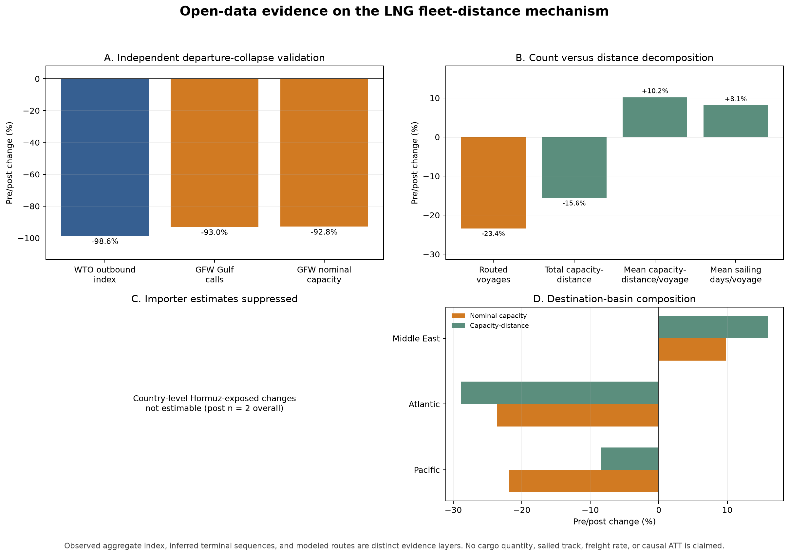

# Integrated LNG Mechanism Results

**Generated from processed artifacts.** Observed, inferred, and modeled quantities are kept separate throughout.

## Evidence chain

1. The independent WTO/AXSMarine LNG outbound index falls **98.6%**.
2. Inferred Qatar/UAE departure calls fall **93.0%**, providing independent directional agreement.
3. At the 30 km terminal radius with expanded route QA, routed voyages fall **23.4%**, while mean capacity-distance per voyage rises **10.2%** (carrier-cluster BCa 95% interval **4.4% to 17.0%**; percentile comparison **4.1% to 16.7%**).
4. At 15 knots, mean modeled sailing days per voyage rise **8.1%**, equivalent to **656 descriptive excess post sailing days** versus the pre mean.
5. Country-level Hormuz-exposed changes are suppressed where post-period voyage support is below the pre-specified minimum; basin aggregates are retained.

## Primary physical-mechanism specification

| Quantity | Pre | Post | Change |
|---|---:|---:|---:|
| Routed voyages | 948 | 726 | -23.4% |
| Nominal capacity-distance (billion m3-nm) | 628.2 | 530.2 | -15.6% |
| Mean nominal capacity-distance/voyage (million m3-nm) | 662.7 | 730.3 | +10.2% |
| Modeled sailing vessel-days at 15 kn | 10518 | 8710 | -17.2% |

## Route shift-share decomposition

Across **189** terminal pairs observed in both periods, the common-route mean change is **38.0 million m3-nm**: **37.1 million** from route-share composition and **0.8 million** within pairs. Entry/exit routes contribute a separate **29.6 million m3-nm** residual.

Modeled distance is fixed within a terminal pair, so the within-pair term reflects vessel-capacity mix, not route elongation. The +10.2% headline is predominantly compositional.

## Highest importer exposures

| Importer | Pre Hormuz-exposed share | Descriptive non-Gulf offset | Total capacity change | Capacity-distance change |
|---|---:|---:|---:|---:|
| Not estimable | Country-level post Hormuz support is only 2 voyages overall | - | - | - |

## Coverage

- Carrier frame: **624 unique IMOs**, no duplicate or invalid capacities.
- Resolved voyages: **971 pre**, **746 post**.
- Expanded route coverage: **97.6% pre**, **97.3% post**.
- WTO comparison uses equal 94-day year-over-year windows and no fitted scaling factor.

## Interpretation boundary

The evidence is consistent with a fleet-distance multiplier among retained post-period LNG voyages: fewer voyages are observed, but retained voyages are longer and consume more nominal capacity-time on average. It does not identify actual cargo quantities, unmet demand, sailed AIS tracks, freight rates, or a causal ATT. The non-Gulf offset ratio is descriptive composition, not a substitution coefficient.

## Figure

