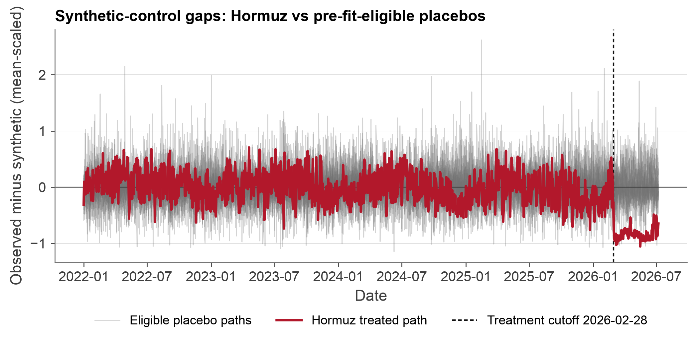

# End-to-End PortWatch Fallback Run

- Working branch: `fallback_portwatch`
- Primary outcome: `hormuz_tanker_transits`
- Robustness outcome: `hormuz_tanker_capacity`
- Primary estimator: `ar_lag1_7`
- Treatment cutoff: `2026-02-28`
- Reporting estimand: **disruption-associated counterfactual shortfall**
- Transformer enabled: **no**

## Headline AR-only result

- Point shortfall: **6,869.0 tanker transits** (52.84/day).
- Disjoint-block rank inference: **p=0.125** from **7** blocks (minimum attainable **1/8**).
- Nominal 95% block-conformal interval: **unbounded**; maximum finite coverage is **87.5%**.
- Descriptive overlapping-placebo 2.5/97.5% quantile band over **130 calendar days**: **5,430.3 to 8,088.9 transits**; no nominal coverage.
- Independent 14-day circular-block bootstrap band: **6,179.5 to 7,549.5 transits**; narrower than the placebo-window band, so width is method-sensitive.
- Temporal-placebo p95: **2,124.3**; separation: **3.234x**.
- The loss exceeds all **35** overlapping placebo windows; the resulting **1/36** reference rank is descriptive, not a p-value.
- BSTS posterior median shortfall: **6,437.9**; 95% posterior predictive interval: **1,754.6 to 11,709.6**.
- BSTS prior-grid median range: **6,457.6 to 6,751.9**; interval-envelope endpoints: **878.6 to 13,836.2**; pre-period PPC pointwise coverage: **97.1%**.

## Layer-1 Inference Table

| Inference layer | Reported value | Support / note | Source artifact |
|---|---|---|---|
| Disjoint-block rank inference | 4.161x; p=0.125 | 7 disjoint blocks; floor 1/8=0.125 | `data/processed/block_conformal_summary.csv` |
| 95% block-conformal interval | unbounded (-inf to inf) | Finite interval unsupported at 95%; maximum finite coverage 87.5% with 7 calibration blocks | `data/processed/block_conformal_summary.csv` |
| Overlapping-placebo 2.5/97.5% quantile band | 5,430.3 to 8,088.9 | Descriptive only; no nominal coverage. 130-calendar-day horizon; 35 placebo windows; 7 non-overlapping horizon windows | `data/processed/long_horizon_intervals_summary.csv` |
| 14-day block-bootstrap band | 6,179.5 to 7,549.5 | 14-day circular blocks; 10000 draws | `data/processed/long_horizon_intervals_summary.csv` |
| Temporal-placebo separation | 3.234x; loss exceeds all overlapping windows | Reference rank 1/36 (not a p-value); 35 overlapping placebo windows and about 7 non-overlapping horizon windows | `data/processed/placebo_time_summary.csv` |

## Pre-treatment validation and residual fidelity

| Model | MASE | RMSE | Residual mean | Residual SD | ACF(1) | ACF(7) |
|---|---|---|---|---|---|---|
| seasonal_naive_7d | 1.005 | 16.691 | 1.828 | 17.049 | 0.259 | 0.289 |
| ar_lag1_7 | 0.920 | 14.862 | -5.001 | 14.361 | 0.481 | 0.231 |
| arx_lag1_7_route | 0.916 | 14.829 | -4.562 | 14.503 | 0.492 | 0.247 |
| arx_lag1_7_route_energy | 0.859 | 14.012 | -1.015 | 14.249 | 0.477 | 0.229 |

For the primary AR-only model, `1140` rolling-origin residuals have median `-5.854`, 5th/95th percentiles `-27.589` / `18.748`. Residual autocorrelation is reported above because remaining serial dependence limits naive pointwise uncertainty claims.

## Specification comparison

| Specification | Role | Pre MASE | Pre RMSE | Point shortfall | Reported lower | Reported upper | Band label | Placebo separation | Diagnostic |
|---|---|---|---|---|---|---|---|---|---|
| ar_lag1_7 | working_primary | 0.920 | 14.862 | 6,869.0 | 5,430.3 | 8,088.9 | overlapping_placebo_2.5_97.5_quantile_band_no_nominal_coverage | 3.234 | 0.028 (overlapping_window_reference_rank_not_p_value) |
| arx_lag1_7_route | conditional_sensitivity | 0.916 | 14.829 | 7,056.4 | 5,502.4 | 8,528.0 | overlapping_placebo_2.5_97.5_quantile_band_no_nominal_coverage | 3.251 | 0.028 (overlapping_window_reference_rank_not_p_value) |
| arx_lag1_7_route_energy | conditional_sensitivity | 0.859 | 14.012 | 8,171.5 | 6,520.0 | 9,319.0 | overlapping_placebo_2.5_97.5_quantile_band_no_nominal_coverage | 5.301 | 0.028 (overlapping_window_reference_rank_not_p_value) |
| synthetic_control | corroboration | NA | 14.739 | 6,174.6 | NA | NA | not_reported | 2.166 | 0.067 (synthetic_control_donor_placebo_p_value) |
| bsts_local_level_weekly | state_space_corroboration | 0.837 | 13.797 | 6,437.9 | 1,754.6 | 11,709.6 | 95%_posterior_predictive_interval_conditional_on_model | NA | NA |

Full machine-readable table: [`data/processed/run_spec_comparison.csv`](../data/processed/run_spec_comparison.csv)

Synthetic-control shortfall is converted from mean-scaled units to a transit-equivalent magnitude for comparison. Its placebo metric is the post/pre RMSPE ratio, not the temporal cumulative-shortfall distribution, and no overlapping-placebo quantile band is asserted for it.
BSTS is an independent state-space corroboration. Its interval is posterior predictive conditional on the local-level model; it is not a causal posterior.

## Independent-block inference

- Disjoint horizon-matched placebo blocks: **7**; honest rank p-value: **0.125** (floor **0.125**).
- Actual / independent-placebo p95 separation: **4.161x**.
- 95% block-conformal interval: **unbounded**; 7 calibration blocks support at most **88%** finite-sample coverage.
- The same facts are reported side by side in the Layer-1 inference table above so conformal support is not treated as a footnote.

## Synthetic-control corroboration

- Pre-period RMSPE: **0.258158 scaled units** (**14.739 transit-equivalent RMSE**).
- Post-period RMSPE: **0.839927**; post/pre ratio: **3.254**.
- Transit-equivalent cumulative gap: **6,174.6**.
- Primary pre-fit screen: placebo pre-RMSPE <= **2.0x** treated; **14/22** placebos eligible and **8** excluded.
- Screened donor-placebo p95 ratio: **1.502**; separation: **2.166x**; rank p-value: **0.066667** (floor **1/15 = 0.066667**).
- Pre-fit threshold sensitivity: p-values range from **0.043478** to **0.083333**; unscreened p=**0.043478**. The 2x rule is the remediation-primary design convention; the full grid is reported so the conclusion does not rest on that single screen.
- Donors: **22**; effective donors: **7.44**; largest weight: `korea_strait` (0.216).
- Donor-pool stress: clean ratio **3.254**, broad-pool ratio **3.378**.
- Donor-by-time stress: **154** fits summarized as **7** disjoint-window maxima; max-statistic rank p-value **0.125** (floor 1/8), actual/block-max-p95 **1.506x**. The individual donor fits are not pooled as independent draws.

## LNG-specific robustness outcome

The public WTO/AXSMarine series is an LNG-only outbound shipment volume index (2025 average = 100) and excludes LPG. It is not a carrier count, physical volume, or freight rate.
- AR LNG-index shortfall over the current post window: **12,923.5 index-points**.
- BSTS posterior median: **12,759.9**; 95% interval **3,105.6 to 25,066.1**.

## Data-quality checks

- Primary transit outcome has complete post-period coverage (130/130 valid days).
- Capacity is a directional secondary, model-sensitive outcome. It has `12` masked post-period values; all `12` are audit-confirmed zero-capacity/positive-transit artifacts and `0` are unexplained. Do not lean on its precise magnitude.

## Figures

## Interpretation guard

These are disruption-associated counterfactual shortfalls in observed AIS-based tanker throughput, not a causal ATT and not an LNG freight-rate estimate.
