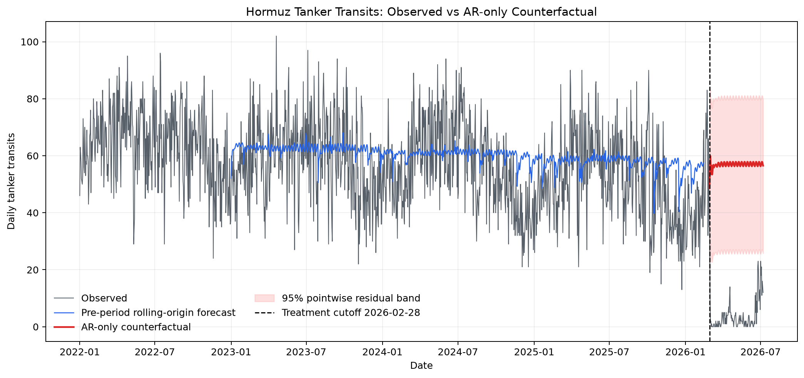
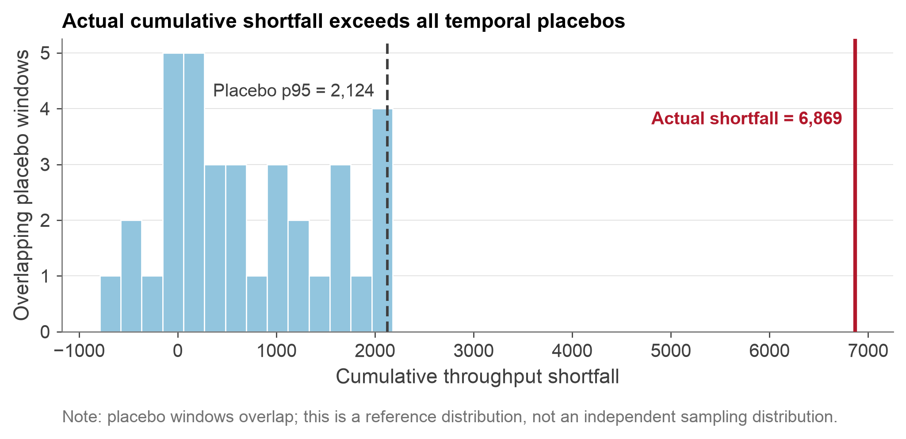
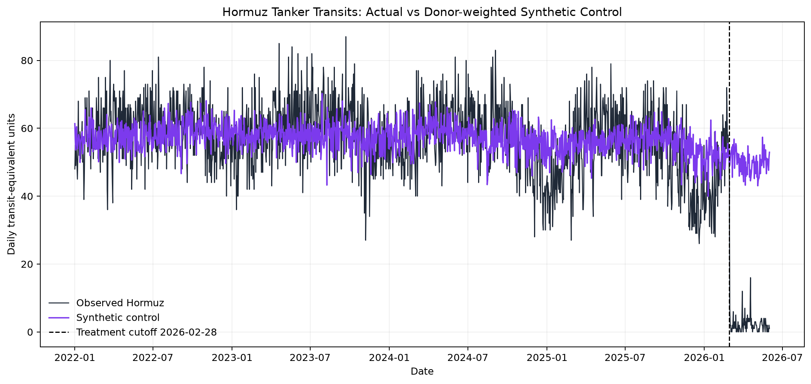
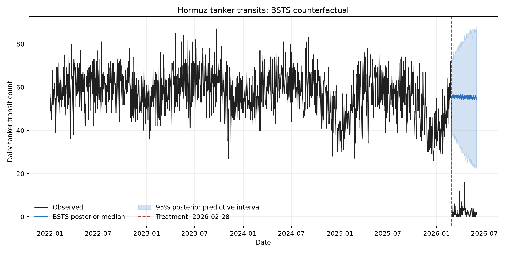
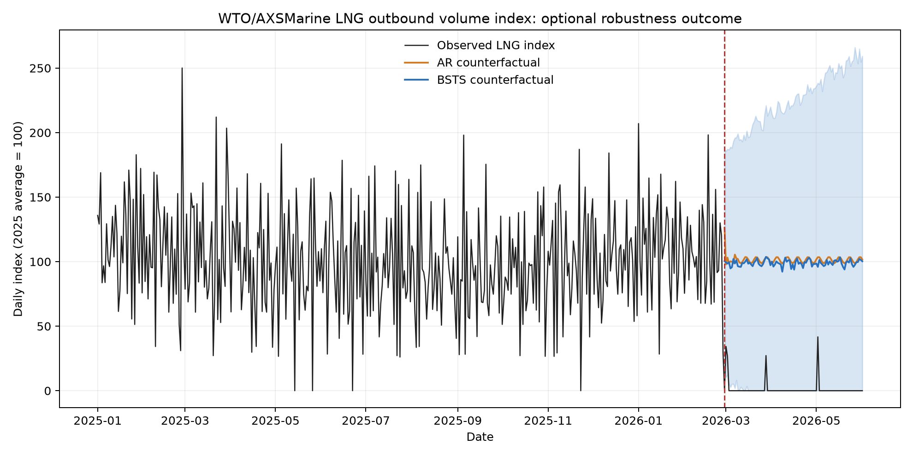

# End-to-End PortWatch Fallback Run

- Working branch: `fallback_portwatch`
- Primary outcome: `hormuz_tanker_transits`
- Robustness outcome: `hormuz_tanker_capacity`
- Primary estimator: `ar_lag1_7`
- Treatment cutoff: `2026-02-28`
- Reporting estimand: **disruption-associated counterfactual shortfall**
- Transformer enabled: **no**

## Headline AR-only result

- Point shortfall: **5,121.3 tanker transits** (54.48/day).
- Horizon-matched 95% interval: **3,933.9 to 5,721.8 transits**.
- Temporal-placebo p95: **1,297.3**; separation: **3.948x**.
- One-sided placebo p-value: **0.027027**, floor-censored with 36 overlapping / about 9 non-overlapping windows.
- BSTS posterior median shortfall: **4,982.2**; 95% posterior predictive interval: **3,348.3 to 6,710.8**.

## Pre-treatment validation and residual fidelity

| Model | MASE | RMSE | Residual mean | Residual SD | ACF(1) | ACF(7) |
|---|---|---|---|---|---|---|
| seasonal_naive_7d | 1.032 | 11.570 | 0.196 | 11.802 | 0.073 | 0.281 |
| ar_lag1_7 | 0.916 | 10.101 | -2.564 | 10.262 | 0.382 | 0.312 |
| arx_lag1_7_route | 0.913 | 10.103 | -2.431 | 10.310 | 0.387 | 0.318 |
| arx_lag1_7_route_energy | 0.885 | 9.845 | -0.836 | 10.140 | 0.365 | 0.293 |

For the primary AR-only model, `1140` rolling-origin residuals have median `-1.951`, 5th/95th percentiles `-19.831` / `13.404`. Residual autocorrelation is reported above because remaining serial dependence limits naive pointwise uncertainty claims.

## Specification comparison

| Specification | Role | Pre MASE | Pre RMSE | Point shortfall | 94d lower | 94d upper | Placebo separation | p-value |
|---|---|---|---|---|---|---|---|---|
| ar_lag1_7 | working_primary | 0.916 | 10.101 | 5,121.3 | 3,933.9 | 5,721.8 | 3.948 | 0.027 |
| arx_lag1_7_route | conditional_sensitivity | 0.913 | 10.103 | 5,176.4 | 3,960.3 | 5,761.6 | 3.961 | 0.027 |
| arx_lag1_7_route_energy | conditional_sensitivity | 0.885 | 9.845 | 5,826.0 | 4,702.2 | 6,528.7 | 4.974 | 0.027 |
| synthetic_control | corroboration | NA | 9.995 | 4,441.2 | NA | NA | 3.871 | 0.043 |
| bsts_local_level_weekly | state_space_corroboration | 0.820 | 9.226 | 4,982.2 | 3,348.3 | 6,710.8 | NA | NA |

Full machine-readable table: [`data/processed/run_spec_comparison.csv`](../data/processed/run_spec_comparison.csv)

Synthetic-control shortfall is converted from mean-scaled units to a transit-equivalent magnitude for comparison. Its placebo metric is the post/pre RMSPE ratio, not the temporal cumulative-shortfall distribution, and no 94-day interval is asserted for it.
BSTS is an independent state-space corroboration. Its interval is posterior predictive conditional on the local-level model; it is not a causal posterior.

## Independent-block inference

- Disjoint 94-day placebo blocks: **9**; honest rank p-value: **0.100** (floor **0.100**).
- Actual / independent-placebo p95 separation: **6.294x**.
- 90% block-conformal interval: **4,017.0 to 6,225.6**.
- 95% block-conformal interval: **unbounded**; nine independent blocks support at most **90%** finite-sample coverage.

## Synthetic-control corroboration

- Pre-period RMSPE: **0.175194 scaled units** (**9.995 transit-equivalent RMSE**).
- Post-period RMSPE: **0.834898**; post/pre ratio: **4.766**.
- Transit-equivalent cumulative gap: **4,441.2**.
- Donor-placebo p95 ratio: **1.231**; separation: **3.871x**; p-value: **0.043478**.
- Donors: **22**; effective donors: **8.74**; largest weight: `korea_strait` (0.184).
- Donor-pool stress: clean ratio **4.766**, broad-pool ratio **4.975**.
- Donor-by-time placebos: **198** fits across **9** disjoint windows; p-value **0.005025**, actual/p95 **3.497x**.

## LNG-specific robustness outcome

The public WTO/AXSMarine series is an LNG-only outbound shipment volume index (2025 average = 100) and excludes LPG. It is not a carrier count, physical volume, or freight rate.
- AR 94-day index-point shortfall: **9,404.7**.
- BSTS posterior median: **9,214.5**; 95% interval **2,666.0 to 17,115.2**.

## Data-quality checks

- Primary transit outcome has complete post-period coverage (94/94 days).
- Capacity robustness outcome has `15` masked post-period values; all `15` are audit-confirmed zero-capacity/positive-transit artifacts and `0` are unexplained.

## Figures

## Interpretation guard

These are disruption-associated counterfactual shortfalls in observed AIS-based tanker throughput, not a causal ATT and not an LNG freight-rate estimate.
